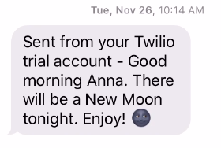
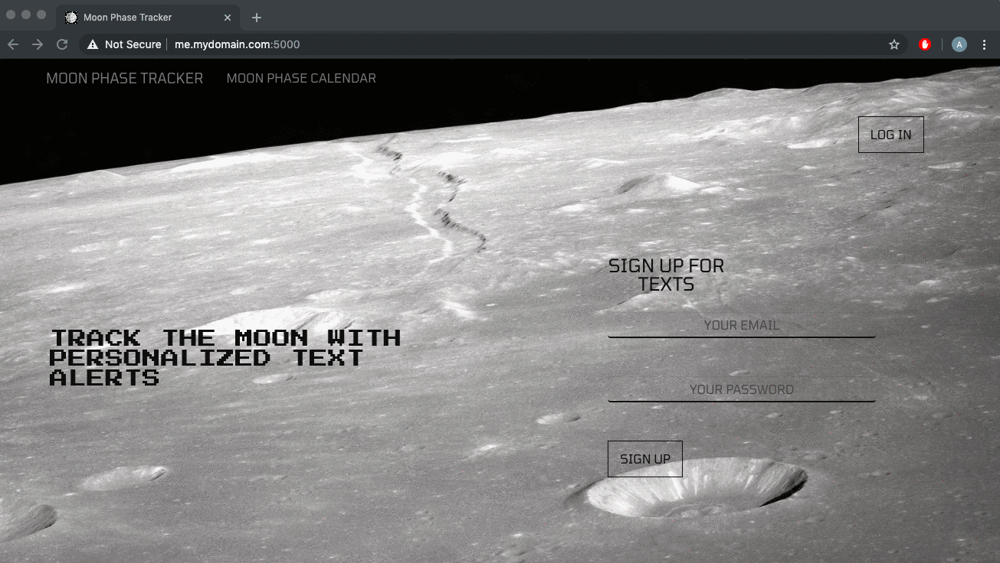
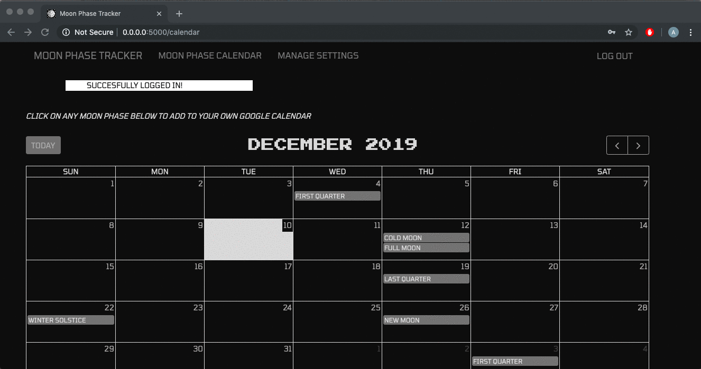
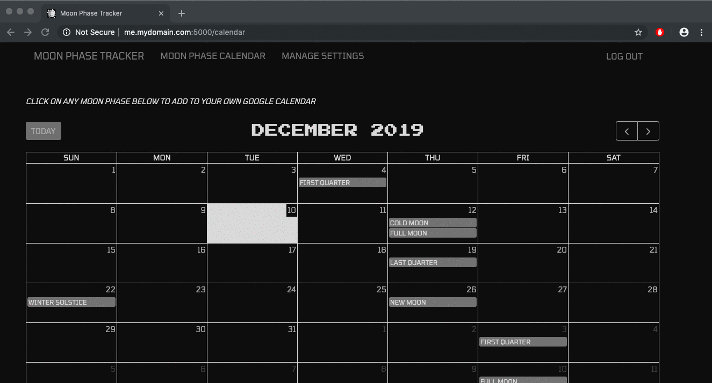
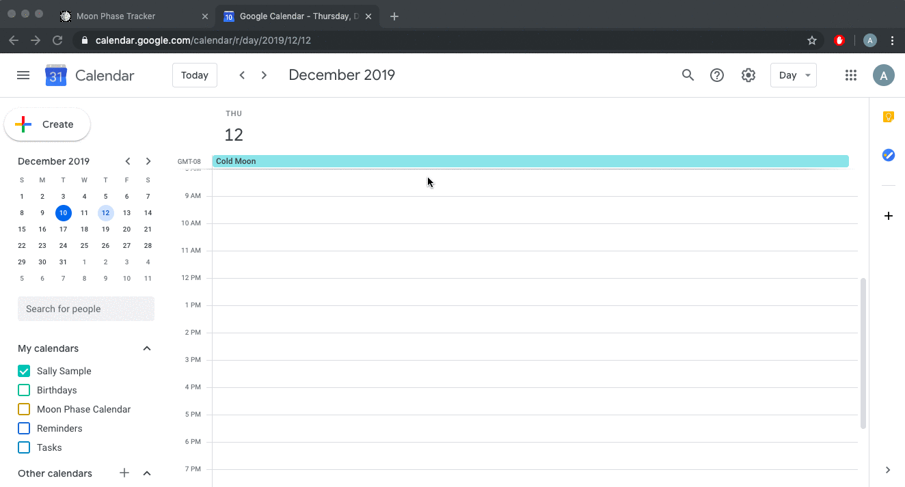

    

## Project Summary

Users interested in tracking moon phases can sign up to receive text alerts for specific moon phase events, or add moon phase events to their personal Google calendars. By using the Python astronomy library, Skyfield, and data from Jet Propulsions Laboratory, moon phase occurrences were calculated from years 2000 – 2050 and stored in the app’s database.

    

## About the Developer

Moon Phase Tracker was developed by Anna Peery. Anna's interest in astrology (Taurus sun, Scorpio moon) inspired her to build this app. This is her first fullstack web app project. Learn more about the developer on [LinkedIn](https://www.linkedin.com/in/avpeery/).

## Tech stack 
**Backend:** Python, Flask, PostgreSQL, SQLAlchemy, OAuth, Skyfield
**Frontend:** JavaScript, AJAX, jQuery, FullCalendar, HTML5, CSS, Jinja2, Bootstrap
**APIs:** Twilio, Google Calendar

## Features

